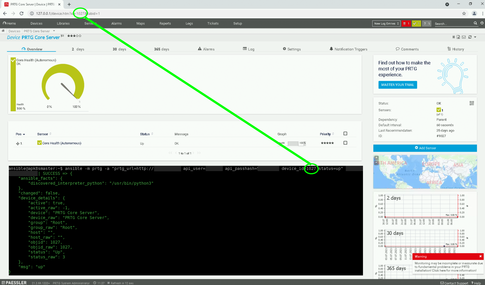

# ansible - server patching framework

**Use at your own risk**

This repository will contain ansible playbooks and custom modules helpful to patch windows and linux systems. You will also be able to run checks and actions on third party systems like prtg, hyper-v, veeam and so on.

# Contents
- [ansible - server patching framework](#ansible---server-patching-framework)
- [Contents](#contents)
- [Setup Framework<a name="Setup"></a>](#setup-framework)
  - [Setup credentials<a name="SetupCredentials"></a>](#setup-credentials)
  - [Module - PRTG<a name="SetupModulePRTG"></a>](#module---prtg)
  - [Module - HYPERV<a name="SetupModuleHyperv"></a>](#module---hyperv)
- [Playbooks<a name="Playbooks"></a>](#playbooks)
  - [PRTG<a name="PlaybooksPRTG"></a>](#prtg)
    - [check-readyness.yml<a name="PlaybooksPRTGCheckReadyness"></a>](#check-readynessyml)
    - [pause-monitoring.yml<a name="PlaybooksPRTGPause"></a>](#pause-monitoringyml)
    - [resume-monitoring.yml<a name="PlaybooksPRTGResume"></a>](#resume-monitoringyml)
  - [Hyper-V<a name="PlaybooksHyperv"></a>](#hyper-v)
    - [hyperv-check-snapshots.yml<a name="PlaybooksHypervCheck"></a>](#hyperv-check-snapshotsyml)
- [Custom Modules<a name="CustomModules"></a>](#custom-modules)
  - [PRTG<a name="CustomModulesPRTG"></a>](#prtg-1)
    - [check_prtg<a name="CustomModulesPRTGCheck"></a>](#check_prtg)
    - [pause_prtg<a name="CustomModulesPRTGPause"></a>](#pause_prtg)
  - [Hyper-V<a name="CustomModulesHyperV"></a>](#hyper-v-1)
    - [hyperv_check_snapshots<a name="CustomModulesHyperVCheck"></a>](#hyperv_check_snapshots)

# Setup Framework<a name="Setup"></a>

Once you have downloaded the repository, you have to configure some parameters so the framework is able to connect to the environment.

## Setup credentials<a name="SetupCredentials"></a>

The credential store contains the passwords to connect to your linux and windows systems.

Setup your vault using the following procedure:

1. Save vault password to file
```
echo MyPassword > vault-password.txt
```

2. create ansible vault
  
```
# create vault
ansible-vault create ./environments/prod/group_vars/all/vault.yml
```

3. enter the following information

```
# Connection parameters
windows_admin_username: "myDomain\\myWindowsUser"
windows_admin_password: "myWindowsPassword"
linux_admin_username: "myLinuxUser"
linux_admin_password: "myLinuxPassword"
```

4. edit hosts file

edit the host file as desired
```
vi ./environments/prod/hosts
```

## Module - PRTG<a name="SetupModulePRTG"></a>

If you plan to use the 'prtg' module you have to setup the following

1. add prtg parameters to your vault

```
ansible-vault edit ./environments/prod/group_vars/all/vault.yml
```
2. append your prtg connection parameters
```
# parameters for module 'prtg'
module_prtg_server_address: 172.20.0.91
module_prtg_api_username: exampleUser
module_prtg_api_passhash: 111111111
```
3. edit environments/prod/group_vars/all/hosts

Add the prtg_device_id to each of the hosts you want to use with the prtg module like so:
```
[windows_servers]
example_server ansible_host=172.20.0.91 prtg_device_id=1027
```
You can find the PRTG device id in your prtg web interface.



The password hash has to be taken from PRTG.

## Module - HYPERV<a name="SetupModuleHyperv"></a>

If you plan to use the 'hyperv' module you have to setup the following:

1. add hyperv parameters to your vault

```
ansible-vault edit ./environments/prod/group_vars/all/vault.yml
```
2. append your prtg connection parameters
```
# parameters for module 'hyperv'
module_hyperv_host: 172.20.0.91
```
3. edit environments/prod/group_vars/all/hosts

Add the hyperv_vmname to each of the hosts you want to use with the hyperv module like so:
```
[windows_servers]
exampleServerVM ansible_host=172.20.0.91 hyperv_vmname=exampleServerVM
```

# Playbooks<a name="Playbooks"></a>
This section contains some examples of playbooks that show the usage of the custom modules in the repository.

## PRTG<a name="PlaybooksPRTG"></a>
Playbooks useful to run checks on you PRTG monitoring, pause sensors, resume sensors. 

> These playbooks use the 'prtg' module of this repository.
> So make sure you have setup the prtg module correctly as specified in the 'Setup Framework' section.

### check-readyness.yml<a name="PlaybooksPRTGCheckReadyness"></a>
> playbooks/prtg/check-readyness.yml

Example Playbook to check the current status of a device / system in prtg.
Each host will be checked in prtg by using its specific device id. 

```
# Usage:
ansible-playbook playbooks/prtg/check-readyness.yml --limit example_server
```

### pause-monitoring.yml<a name="PlaybooksPRTGPause"></a>
> playbooks/prtg/pause-monitoring.yml

Example Playbook to pause monitoring of a device / system in prtg.

```
# Usage:
ansible-playbook playbooks/prtg/pause-monitoring.yml --limit example_server
```
### resume-monitoring.yml<a name="PlaybooksPRTGResume"></a>
> playbooks/prtg/resume-monitoring.yml

Example Playbook to resume monitoring of a device / system in prtg.

```
# Usage:
ansible-playbook playbooks/prtg/resume-monitoring.yml --limit example_server
```

## Hyper-V<a name="PlaybooksHyperv"></a>
Playbooks useful to run checks on your Hyper-V Host, check snapshots and age, create snapshots, delete snapshots. 

> These playbooks use the 'hyperv' module of this repository.
> So make sure you have setup the hyperv module correctly as specified in the 'Setup Framework' section.

### hyperv-check-snapshots.yml<a name="PlaybooksHypervCheck"></a>
> playbooks/hyperv/hyperv-check-snapshots.yml

Example Playbook to check wether a hyper-v vm has a snapshot and age is younger than 1 day.

```
# Usage:
ansible-playbook playbooks/hyperv/hyperv-check-snapshots.yml --limit example_server
```

# Custom Modules<a name="CustomModules"></a>
This repository contains custom modules for ansible so you are able to connect to 3rd party systems, run checks and actions.

## PRTG<a name="CustomModulesPRTG"></a>
Modules for Paessler PRTG monitoring.

### check_prtg<a name="CustomModulesPRTGCheck"></a>
> library/action_plugins/check_prtg

Custom module that can be used to check the status of a device in prtg monitoring (up, warning, down).

* Module should be executed on a linux system that has connectivity (http) to the prtg server.
* For Example Usage see playbook [check-readyness.yml](#PlaybooksPRTGCheckReadyness)

**Parameters**
* **api_user**:
  PRTG user for making API calls (can be local or domain user i.e. "prtgadmin")
* **api_passhash**:
  Passhash from PRTG for API access (i.e. 1234512345)
* **prtg_url**:
  Address of PRTG Server (i.e. "192.168.2.100") 
* **device_id**:
  Id of device in PRTG that should be checked (i.e. "1022")
* **status**:
  Desired Status of device in PRTG (i.e. "up", "warning", "down"). Default: "up"
* **waitFor**:
  If device does not have the desired status in PRTG, how many seconds should we wait (default: 0)

### pause_prtg<a name="CustomModulesPRTGPause"></a>
> library/action_plugins/pause_prtg

Custom module that can be used to pause or resume monitoring of a device in prtg.

* Module should be executed on a linux system that has connectivity (http) to the prtg server.
* For Example Usage see playbook [pause-monitoring.yml](#PlaybooksPRTGPause)
* For Example Usage see playbook [resume-monitoring.yml](#PlaybooksPRTGResume)

**Parameters**
* **api_user**:
  PRTG user for making API calls (can be local or domain user i.e. "prtgadmin")
* **api_passhash**:
  Passhash from PRTG for API access (i.e. 1234512345)
* **prtg_url**:
  Address of PRTG Server (i.e. "192.168.2.100") 
* **device_id**:
  Id of device in PRTG that should be checked (i.e. "1022")
* **status**:
  Desired Status of device in PRTG after the action is taken (i.e. "paused", "running"). Default: "paused"

## Hyper-V<a name="CustomModulesHyperV"></a>
Modules for checking-, creating- and deleting snapshots on Microsoft Hyper-V Hypervisors.

### hyperv_check_snapshots<a name="CustomModulesHyperVCheck"></a>
> library/action_plugins/hyperv_check_snapshots

Custom module that can be used to check wether a hyper-v vm has a snapshot and also age of the snapshot.

* Module is a powershell script should be executed on a windows hyper-v host
* For Example Usage see playbook [hyperv-check-snapshots.yml](#PlaybooksHypervCheck)

**Parameters**
* **vmname**:<br />
  name of hyper-v vm that should be checked (i.e. "myvm01")
* **state**:<br />
  state of snapshot should be: "absent" or "present"
* **snapshotAgeYoungerThanMinutes**:<br />
  max snapshot age in minutes if "present" was specified
